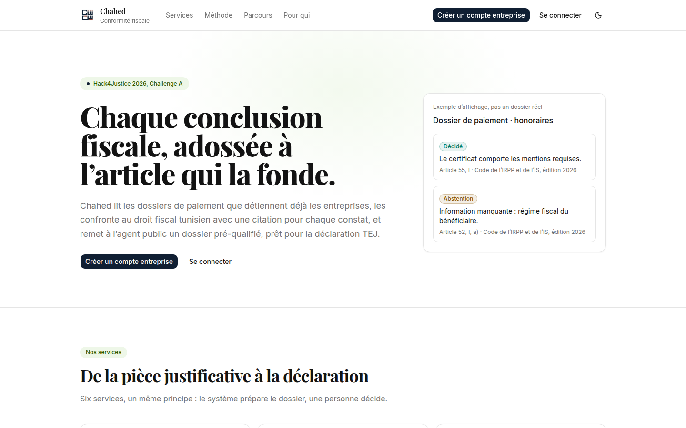
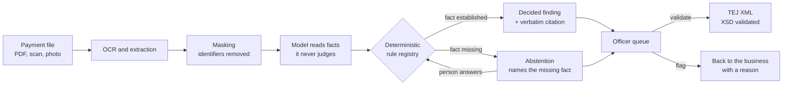
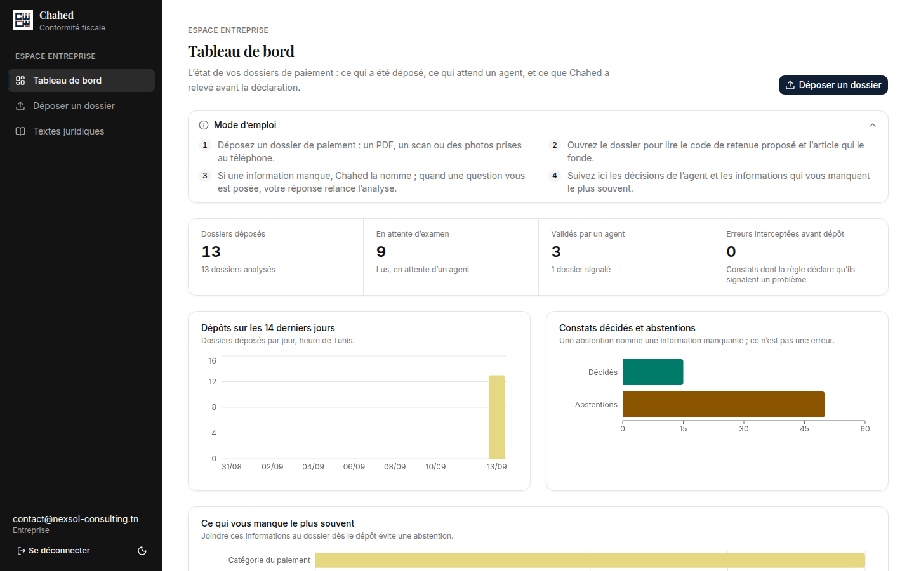
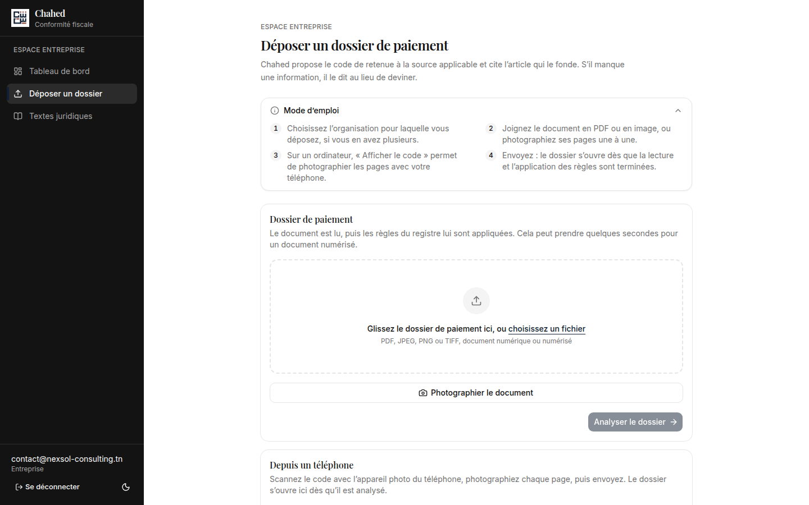
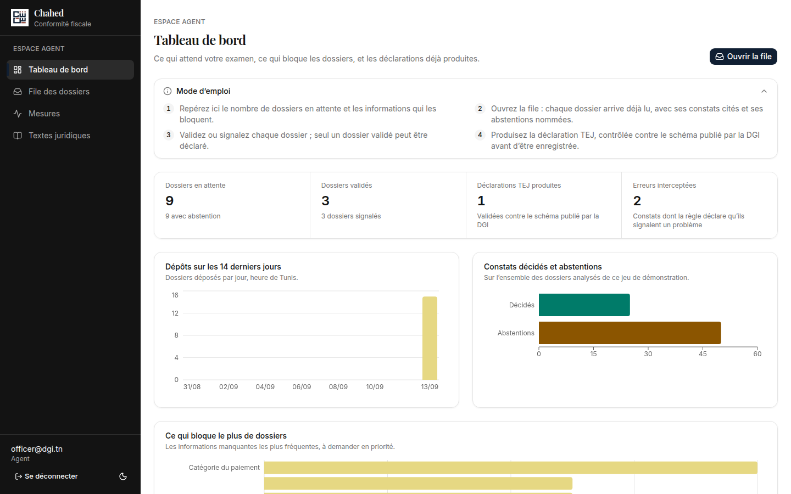
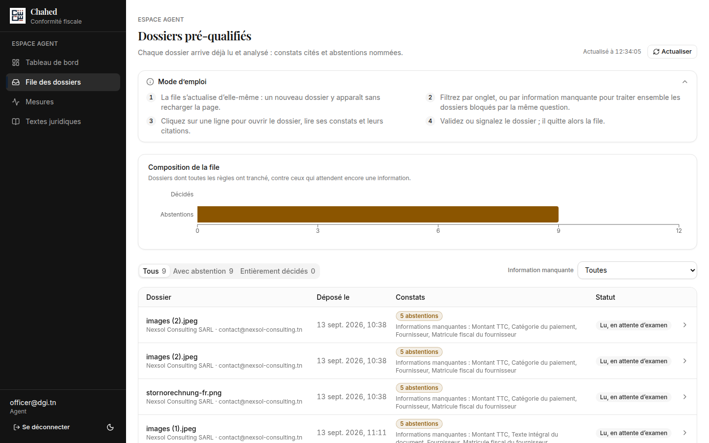
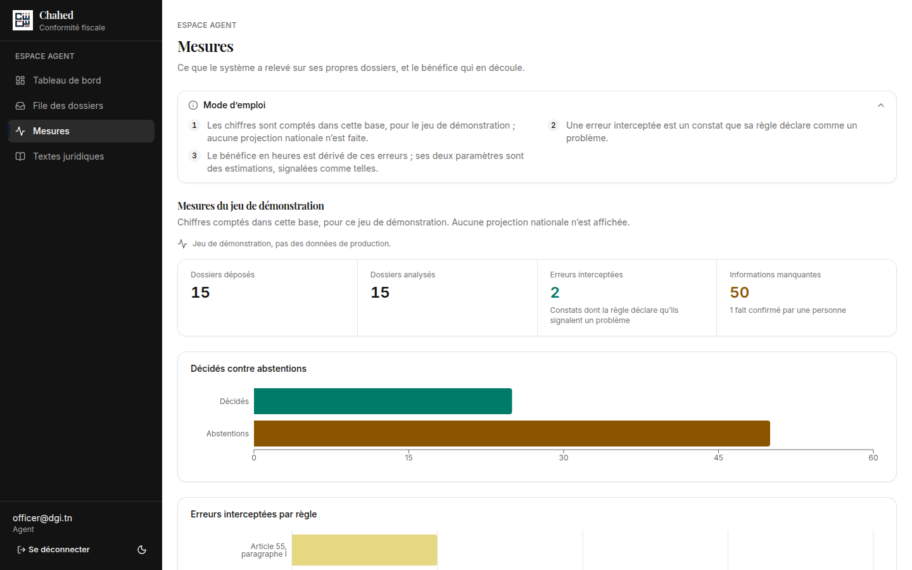
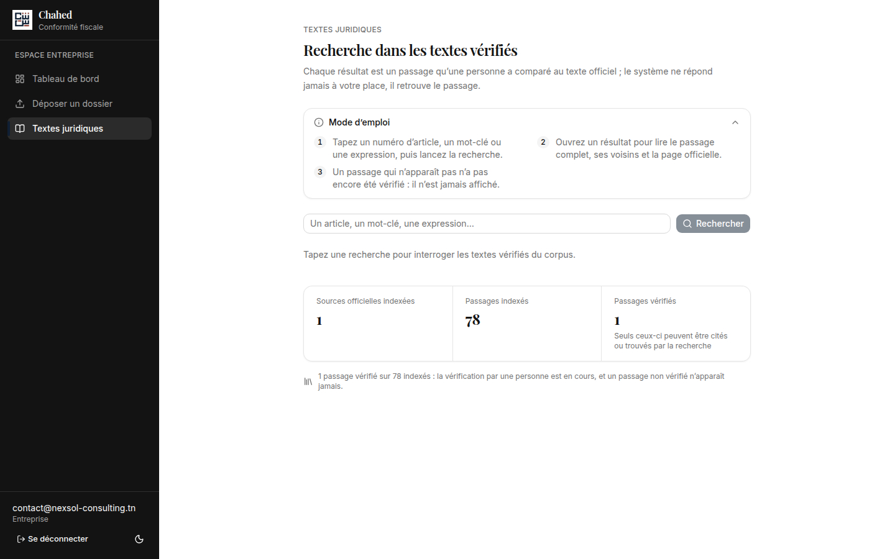
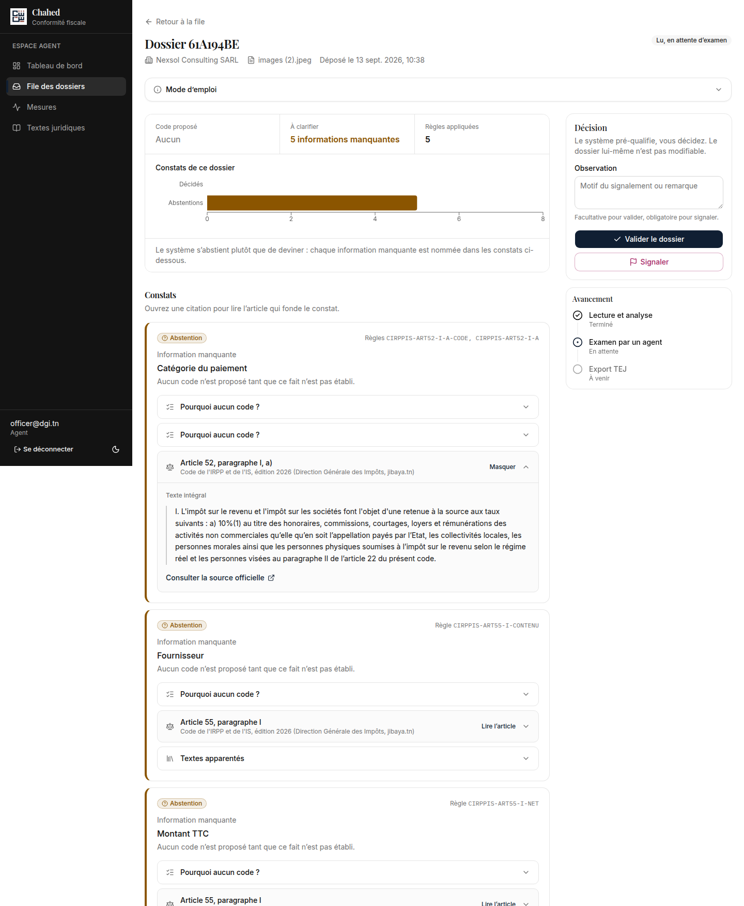

<p align="center">
  
</p>

<h1 align="center">Chahed</h1>

<p align="center">
  <strong>Every tax conclusion, backed by the article that grounds it.</strong><br />
  Regulatory compliance for Tunisian MSMEs. Built for Hack4Justice 2026, Challenge A.
</p>

<p align="center">
  <a href="https://chahed.ahmedxsaad.me/"><strong>Live demo</strong></a> ·
  <a href="#try-it-in-five-minutes">Try it</a> ·
  <a href="#documentation">Docs</a> ·
  <a href="#run-it-locally">Run it locally</a>
</p>

<p align="center">
  
</p>

---

## TL;DR

Chahed reads the payment documents a Tunisian business already holds, checks them against Tunisian tax law, and cites the exact article behind every conclusion. When it cannot decide, it says so and names what is missing. It does not guess, and it does not bluff with confidence. A public officer then gets a pre-qualified file and a TEJ export that validates against the DGI's published schema.

One sentence to remember:

> Every error a business makes costs the administration more than it costs the business.

---

## The problem

Most Tunisian MSMEs have no in-house accountant and no budget for legal counsel. They still have to get their withholding tax (retenue à la source) right at every supplier payment, and pick the correct code from a long official list.

So they make mistakes. Not fraud, confusion.

The business pays a penalty once. The administration pays several times: it processes the corrected declaration, investigates the cross-check inconsistency, answers the support call, and sometimes handles a dispute. Stopping one error at the source removes that whole chain of work.

The hard part is not filling in a form. Choosing the right withholding code needs three facts about the supplier that never appear on the invoice: their tax regime, their status, and what the service really was. That is a retrieval problem with a correct answer, which is exactly the kind of problem Chahed is built for.

### What we treat, and what we refuse to

| Family | What it is | Chahed? |
|---|---|---|
| Missing | Businesses that should declare and do not | No, that needs the DGI's internal database |
| **Erroneous** | A declaration with a wrong code, id or amount | **Yes** |
| Fraudulent | False invoices, hidden income | No, that is a job for investigators |
| **Confused** | Taxpayers who want to comply and cannot manage it | **Yes** |

A fraud detector is tax policing. A tool that stops honest people from getting fined for being confused is a different product, and it is ours.

---

## What Chahed does

| Capability | In plain words |
|---|---|
| **Document reading** | Takes digital PDFs, scans and phone photos. OCR and structured extraction pull out parties, tax ids, amounts and the service description, and each field is outlined where it was found on the page. |
| **Withholding code proposal** | Proposes the applicable code, together with the source, article number, verbatim text and a link to the official page. |
| **Honest abstention** | When a fact is missing, Chahed abstains and names the fact. You answer the question in the file and the rule decides again. |
| **Decision trace** | "Why this code?" shows which fact came from the document, which came from a person, and what the rule did with them. |
| **Identifier masking** | Tax ids, bank details, emails and phone numbers are masked before any text reaches a language model, and the masked text is shown next to the original. |
| **Officer queue** | Pre-qualified files arrive with their missing facts already named. The officer validates or flags, and never edits the file itself. |
| **TEJ export** | A validated file produces TEJ XML that is checked against the DGI's XSD. Schema errors are explained in French, on the field that caused them. |
| **Verified legal search** | Search over legal passages that a person has compared with the official text. An unverified passage is never displayed, not even with a warning label. |
| **Phone capture** | Scan a QR code on the laptop and photograph the pages with your phone. They land in the same file. |
| **Impact panel** | Counts errors intercepted and missing facts on the system's own data, with every estimate clearly labelled. |

---

## How it works



1. **Ingestion.** The business uploads a payment file. OCR and structured extraction read it.
2. **Code decision.** The rule registry, grounded in the DGI code list and the articles that govern it, proposes the code.
3. **Proof.** Every conclusion links to the exact article, one click away. That is a citation you can check, not a claim you have to trust.
4. **Abstention.** If the information cannot decide the case, the system says so and names what is missing.
5. **Handover.** The officer gets the pre-qualified file, sees what was already checked, and validates or flags without starting from scratch.

---

## The design law (the part we refuse to compromise on)

AI compliance tools usually fail in one particular way: the model sounds confident and is wrong. Chahed is designed so that this cannot happen.

- **Compliance judgement is deterministic code.** The model extracts facts, explains and drafts text. It never decides whether a finding exists.
- **Assisted rules are the one exception.** The model may supply a fact the document does not state, with a confidence score, and the deterministic rule judges from that fact. If the model cannot establish the fact, the rule asks a human a specific question.
- **No finding without a citation.** Every rule carries its source, article number, verbatim text and URL. A rule without a verified citation does not enter the registry.
- **Only verified text reaches a screen.** A person checks every legal passage against the official source. A model-drafted explanation appears only after a person approves it.
- **The human decides.** The system pre-qualifies and the officer validates. So when someone asks "who is responsible if it's wrong?", there is a name to point to.

In short: the model reads, the code judges, the human decides, and nobody improvises.

---

## Who uses it

| Role | Space | What they do |
|---|---|---|
| **Business owner** | `/entreprise` | Uploads payment files, reads the proposed code and its article, answers abstentions |
| **Accountant** | `/entreprise` | Same as above, for every organisation they are delegated |
| **Public officer** | `/agent` | Works the queue of pre-qualified files, validates or flags, produces TEJ declarations, reads the impact panel |
| **Admin** | `/admin` | Maintains the rule registry and tracks the human verification of the legal corpus |

---

## Screenshots

<table>
  <tr>
    <td width="50%"><br /><sub><b>Business dashboard.</b> Files filed, files waiting for an officer, and the facts you keep forgetting.</sub></td>
    <td width="50%"><br /><sub><b>Upload.</b> Drop a PDF, pick an image, or photograph the pages from your phone.</sub></td>
  </tr>
  <tr>
    <td width="50%"><br /><sub><b>Officer dashboard.</b> What is waiting, what is blocking files, and the TEJ declarations already produced.</sub></td>
    <td width="50%"><br /><sub><b>Pre-qualified queue.</b> Each row names its missing facts before you open it.</sub></td>
  </tr>
  <tr>
    <td width="50%"><br /><sub><b>Impact panel.</b> Errors intercepted, counted on the system's own data, with estimates labelled.</sub></td>
    <td width="50%"><br /><sub><b>Verified legal search.</b> If no person has verified a passage, you will not see it.</sub></td>
  </tr>
</table>

<p align="center">
  <br />
  <sub><b>The click that is the pitch.</b> An abstention names the missing fact, and "Lire l’article" opens the verbatim text of Article 52, I, a) with a link to the official source.</sub>
</p>

---

## Tech stack

| Layer | Choice |
|---|---|
| Front end | Next.js 16 (App Router), React 19, TypeScript, shadcn/ui, recharts |
| Back end | Python, FastAPI, SQLAlchemy, Alembic |
| Data | PostgreSQL with pgvector |
| Reading | Tesseract OCR, locally; only masked text goes to a hosted model |
| Retrieval | Hybrid search (full text + sentence-transformers embeddings, fused by reciprocal rank) |
| Models | Through OpenRouter only, behind `api/app/providers/`, so the provider can be swapped |
| Legal ground truth | Code de l’IRPP et de l’IS (2026 edition), DGI TEJ XSD v1.0, rule registry in `rules/` |
| Deploy | Docker Compose, Caddy (HTTPS), Terraform on one AWS EC2 instance, GitHub Actions self-hosted runner redeploying on every push to `main` |

---

## Documentation

The `docs/` folder is the source of truth. Code follows the docs, not the reverse.

| Document | Read it when you want to know |
|---|---|
| [`docs/plan.md`](docs/plan.md) | What we build and why: the problem, scope, roles, demo moments, phases and gates, Q&A prep |
| [`docs/feature-research.md`](docs/feature-research.md) | The detail and evidence for every planned feature, including the RAG implementation plan |
| [`docs/architecture.md`](docs/architecture.md) | Repository layout, pipeline, data model, API surface, provider and configuration boundaries |
| [`docs/design.md`](docs/design.md) | The binding visual system: colour, typography, layout, motion, screen specs |
| [`docs/frontend-plan.md`](docs/frontend-plan.md) | The front-end work plan and how it is verified |
| [`docs/facts.md`](docs/facts.md) | Every fact we may state, with its verification status (and a list of claims we refuse to make) |
| [`docs/decision-log.md`](docs/decision-log.md) | Every significant decision, dated, with the options considered and the reasons |
| [`docs/deploy.md`](docs/deploy.md) | The AWS runbook: provision, deploy, seed, continuous deployment, custom domain, teardown |

Each directory also has its own `CLAUDE.md` with local rules. Read it before working there.

---

## Try it in five minutes

The platform is live at **<https://chahed.ahmedxsaad.me/>**. The interface is in French.

### Demo accounts

| Role | Email | Password |
|---|---|---|
| Business (Nexsol Consulting SARL) | `contact@nexsol-consulting.tn` | `demo-pass-2026` |
| Public officer | `officer@dgi.tn` | `demo-pass-2026` |

These accounts are shared and public, so please be kind to the demo data. Other people are using the same accounts.

### Part 1: be a business

1. Open <https://chahed.ahmedxsaad.me/> and click **Se connecter**.
2. Sign in as `contact@nexsol-consulting.tn`. You land on the **Tableau de bord**: files filed, files waiting for an officer, and the facts that most often block your files.
3. Get a test document. Download one of the hero fixtures from [`fixtures/hero/`](fixtures/hero), for example `hero-01-honoraires-clean.pdf` or `hero-02-honoraires-abstain.pdf`. Any real invoice (PDF, JPEG, PNG or TIFF) works too.
4. Go to **Déposer un dossier**. Drag the file into the drop zone, or click **Photographier le document**. On a laptop, **Afficher le code** shows a QR code so you can photograph the pages with your phone.
5. Click **Analyser le dossier**. Reading and rule evaluation take a few seconds for a scanned document.
6. The file opens. At the top you see **Code proposé**, **À clarifier** (the missing facts) and **Règles appliquées**.
7. Under **Constats**, open **Lire l’article** on any finding to read the verbatim legal text, then **Consulter la source officielle** to check it at the source. Open **Pourquoi aucun code ?** to see the decision trace.
8. If the system abstained, answer its question in the file. The rule decides again using your answer.
9. Scroll to **Texte extrait** to compare the text read from the document with the masked text that was sent to the model.
10. Try **Textes juridiques** and search for an article number or a keyword. Only verified passages come back.

### Part 2: be the officer

1. Click **Se déconnecter**, then sign in as `officer@dgi.tn`.
2. The **Tableau de bord** shows files waiting, files validated, TEJ declarations produced and errors intercepted. Click **Ouvrir la file**.
3. In **File des dossiers**, use the tabs (**Tous**, **Avec abstention**, **Entièrement décidés**) or the **Information manquante** filter to handle files blocked by the same question together.
4. Open a file. Read its findings and their citations, exactly as the business sees them.
5. Decide in the **Décision** panel: **Valider le dossier** (the observation is optional) or **Signaler** (the observation is required, because a flag needs a reason).
6. A validated file moves to **Export TEJ**. Produce the declaration: it is checked against the DGI schema, and any refused value is explained in French on its field. Fix it and export again until you see "Le fichier XML est conforme au schéma TEJ."
7. Open **Mesures** for the impact panel: files filed, errors intercepted, missing facts, and the derived agency benefit with its estimates labelled.

### Part 3: bring your own business

Click **Créer un compte entreprise** on the home page (or go to `/inscription`), and enter your organisation name, matricule fiscal, email and a password. Officer, accountant and admin accounts cannot be created from a public form, on purpose. See below.

---

## Run it locally

The whole stack (PostgreSQL with pgvector, the FastAPI back end and the Next.js front end) runs with Docker Compose.

1. **Configure the API.** `cp api/.env.example api/.env`, then fill in `OPENROUTER_API_KEY` and `OPENROUTER_MODEL_ID`. `DATABASE_URL` is set by `docker-compose.yml`.
2. **Configure the web app.** `cp web/.env.example web/.env`. `API_BASE_URL` is set by `docker-compose.yml`. Set `PUBLIC_WEB_URL` to the address a phone can reach the app at, for the capture QR code.
3. **Start it.** `docker compose up --build`, then open <http://localhost:3000>.
4. **Create accounts.** Businesses sign up at `/inscription`. Officer, admin and accountant accounts are created from the command line, and the password is prompted for, never passed as a flag:
   ```bash
   docker compose exec api uv run python -m app.auth.create_user agent@example.tn officer
   docker compose exec api uv run python -m app.auth.create_user admin@example.tn admin
   # an accountant also takes --organisation <matricule fiscal>, once per organisation
   ```
5. **Seed the demo dataset (optional).** `seed/seed_demo_data.py` sends the five hero fixtures through the real pipeline, with no fake inserts. Its docstring and [`docs/deploy.md`](docs/deploy.md) explain how to run it.

To work on one side without Docker, follow the local setup in [`api/CLAUDE.md`](api/CLAUDE.md) or [`web/CLAUDE.md`](web/CLAUDE.md). To deploy your own instance, follow [`docs/deploy.md`](docs/deploy.md).

---

## Repository map

```
web/          Next.js app: (auth), (msme), (officer), (admin) route groups, components, API proxy
api/          FastAPI back end: auth, extraction, corpus retrieval, rules, counterparty, export, providers
rules/        Rule registry definitions, each with its verbatim legal citation
corpus/       Raw legal texts and their article-level chunks
schemas/      DGI TEJ XSD files and the validation harness
fixtures/     The five hero demo documents
seed/         Fixture generator and demo dataset seeder
deploy/       Terraform, production Compose file, Caddy
docs/         Plan, architecture, design, facts, decisions, deploy runbook, screenshots
```

---

## What Chahed deliberately does not do

Supplier or fraud scoring. Automatic submission to TEJ. Model-computed tax rates. TEIF invoice issuance. A general legal chatbot. Generating certificate PDFs.

Each of these is a conscious "no", and the reasons are in `docs/feature-research.md` section 7. A tool that does six things carefully is more useful than one that does twenty things approximately.

---

<p align="center">
  <sub>Built for Hack4Justice 2026, Challenge A. Every legal claim on screen has been checked by a person against the official text.</sub>
</p>
